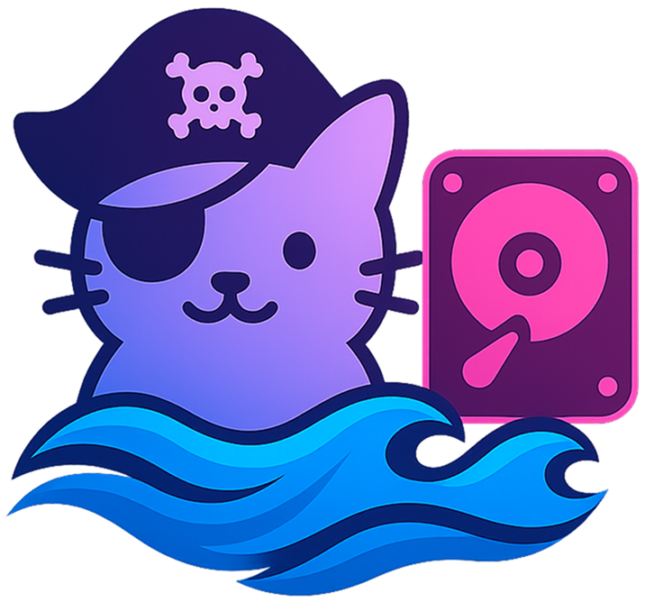

<p align="center">
  <a href="https://github.com/moderniselife/SchroDrive">
    
  </a>
</p>

<p align="center">
  <a href="https://github.com/moderniselife/SchroDrive">
    
  </a>
  <a href="https://github.com/moderniselife/SchroDrive/actions">
    
  </a>
  <a href="https://github.com/moderniselife/SchroDrive/blob/main/LICENSE">
    
  </a>
  <a href="https://ghcr.io/moderniselife/schrodrive">
    
  </a>
</p>

# SchröDrive

The ultimate media automation orchestrator. SchröDrive seamlessly integrates with Overseerr to automatically search Prowlarr for the best torrents and deliver them to your preferred debrid service. Currently supporting TorBox with upcoming support for Real-Debrid, All-Debrid, and Premiumize.

## Releases
- [Latest Release](https://github.com/moderniselife/SchroDrive/releases/latest) - Auto-incremented version and release notes
- Docker image: `ghcr.io/moderniselife/schrodrive:latest` and `ghcr.io/moderniselife/schrodrive:vX.Y.Z`

## Features
- Webhook endpoint for Overseerr notifications
- Prowlarr search using `/api/v1/search`
- Picks best result by seeders (fallback by size)
- Adds magnet to TorBox
- CLI for manual search/add
- Docker image

## 🚀 Coming Soon
**Virtual Drive Mount Integration** - Seamlessly manage your downloaded content with automatic virtual drive mounting. SchröDrive will intelligently organize and mount completed downloads as virtual drives, providing instant access to your media library across your network. Experience transparent file management with zero manual intervention.

**Multi-Provider Debrid Support** - Expand your download ecosystem beyond TorBox. SchröDrive will soon integrate with leading debrid services including Real-Debrid, All-Debrid, and Premiumize, giving you the flexibility to choose the optimal provider for your content needs. Switch between providers effortlessly or use multiple services in parallel for maximum availability and speed.

## Modes
- **Webhook mode (default)**
  - Endpoint: `POST /webhook/overseerr`
  - Now responds immediately with `202 Accepted` and processes in the background to avoid Overseerr's 20s timeout window.
  - Optional auth header via `OVERSEERR_AUTH`.

- **Overseerr API Poller (optional)**
  - Polls Overseerr for `approved` requests via `GET /request?filter=approved`.
  - Requires: `OVERSEERR_URL` (must include `/api/v1`) and `OVERSEERR_API_KEY`.
  - Enable with `RUN_POLLER=true` (and optionally set `RUN_WEBHOOK=false`).
  - Poll interval configurable via `POLL_INTERVAL_S` (default 30s).

## Auto-Update
- SchröDrive can check GitHub Releases and auto-restart when a newer version is available.
- Works best with Docker using a supervisor (e.g., restart policy) plus Watchtower to pull the new image.

Environment:
- `AUTO_UPDATE_ENABLED` (default `false`)
- `AUTO_UPDATE_INTERVAL_S` (default `3600`)
- `AUTO_UPDATE_STRATEGY` = `exit` | `git`
  - `exit`: process exits when an update is found; your supervisor/Compose restarts it. For Docker, add Watchtower to pull new images.
  - `git`: runs `git pull --ff-only` then exits (for bare-metal/git installs).
- `REPO_OWNER` (default `moderniselife`)
- `REPO_NAME` (default `SchroDrive`)

Example (Docker Compose .env):
```
AUTO_UPDATE_ENABLED=true
AUTO_UPDATE_INTERVAL_S=1800
AUTO_UPDATE_STRATEGY=exit
```

Watchtower service (optional):
```yaml
  watchtower:
    image: containrrr/watchtower
    restart: unless-stopped
    command: --interval 900 --cleanup
    volumes:
      - /var/run/docker.sock:/var/run/docker.sock
```
This will pull `ghcr.io/moderniselife/schrodrive` updates automatically and restart the container when the app exits.

## Requirements
- Node.js 18+
- Prowlarr URL and API key
- TorBox API key
- Optional secret for Overseerr webhook Authorization

## Environment Variables
- `PORT` (default `8978`)
- `PROWLARR_URL` (e.g. `http://localhost:9696`)
- `PROWLARR_API_KEY`
- `PROWLARR_CATEGORIES` (comma-separated category IDs, optional)
- `TORBOX_API_KEY`
- `TORBOX_BASE_URL` (default `https://api.torbox.app`)
- `OVERSEERR_AUTH` (optional Authorization value to require on webhook)
- `OVERSEERR_URL` (must include `/api/v1`)
- `OVERSEERR_API_KEY`
- `POLL_INTERVAL_S` (default 30s)
- `RUN_WEBHOOK` (default true)
- `RUN_POLLER` (default false)

## Install & Build
```bash
npm ci
npm run build
```

## Run (Local)
```bash
PROWLARR_URL=http://localhost:9696 \
PROWLARR_API_KEY=xxxxx \
TORBOX_API_KEY=tb_xxxxx \
node dist/index.js serve
```

Health check:
```bash
curl http://localhost:8080/health
```

## Overseerr Webhook Setup
- Add a Webhook notification agent in Overseerr Settings -> Notifications
- Webhook URL: `http://<host>:8978/webhook/overseerr`
- Authorization Header (optional): set the value to your chosen secret and set `OVERSEERR_AUTH` to the same value in this service
- JSON Payload (example):
```json
{
  "notification_type": "{{notification_type}}",
  "event": "{{event}}",
  "subject": "{{subject}}",
  "message": "{{message}}",
  "image": "{{image}}",
  "{{media}}": {
    "media_type": "{{media_type}}",
    "tmdbId": "{{media_tmdbid}}",
    "tvdbId": "{{media_tvdbid}}",
    "status": "{{media_status}}",
    "status4k": "{{media_status4k}}"
  },
  "{{request}}": {
    "request_id": "{{request_id}}",
    "requestedBy_email": "{{requestedBy_email}}",
    "requestedBy_username": "{{requestedBy_username}}",
    "requestedBy_avatar": "{{requestedBy_avatar}}",
    "requestedBy_settings_discordId": "{{requestedBy_settings_discordId}}",
    "requestedBy_settings_telegramChatId": "{{requestedBy_settings_telegramChatId}}"
  },
  "{{issue}}": {
    "issue_id": "{{issue_id}}",
    "issue_type": "{{issue_type}}",
    "issue_status": "{{issue_status}}",
    "reportedBy_email": "{{reportedBy_email}}",
    "reportedBy_username": "{{reportedBy_username}}",
    "reportedBy_avatar": "{{reportedBy_avatar}}",
    "reportedBy_settings_discordId": "{{reportedBy_settings_discordId}}",
    "reportedBy_settings_telegramChatId": "{{reportedBy_settings_telegramChatId}}"
  },
  "{{comment}}": {
    "comment_message": "{{comment_message}}",
    "commentedBy_email": "{{commentedBy_email}}",
    "commentedBy_username": "{{commentedBy_username}}",
    "commentedBy_avatar": "{{commentedBy_avatar}}",
    "commentedBy_settings_discordId": "{{commentedBy_settings_discordId}}",
    "commentedBy_settings_telegramChatId": "{{commentedBy_settings_telegramChatId}}"
  },
  "{{extra}}": []
}
```
- Recommended events: Request Approved (or as desired)

## CLI
Search Prowlarr and print the best result:
```bash
node dist/index.js search "Big Buck Bunny 2008"
```

Add a magnet directly to TorBox:
```bash
node dist/index.js add --magnet "magnet:?xt=urn:btih:..."
```

Search and add the best result automatically:
```bash
node dist/index.js add --query "Ubuntu 24.04"
```

## Docker Compose
### Prerequisites
- Docker and Docker Compose installed
- Prowlarr API key
- TorBox API key

### Step 1: Clone the repository
```bash
git clone https://github.com/moderniselife/SchroDrive.git
cd SchroDrive
```

### Step 2: Configure environment variables
```bash
cp .env.example .env
```

Edit `.env` with your credentials:
```env
# Prowlarr Configuration
PROWLARR_URL=http://prowlarr:9696
PROWLARR_API_KEY=your_prowlarr_api_key_here
PROWLARR_CATEGORIES=5000,2000

# TorBox Configuration
TORBOX_API_KEY=tb_your_torbox_api_key_here
TORBOX_BASE_URL=https://api.torbox.app

# Overseerr Webhook (optional)
OVERSEERR_AUTH=your_secret_auth_header_value

# Service Port (optional)
PORT=8978
```

### Step 3: Start the services
```bash
docker-compose up -d
```

### Step 4: Verify the services
Health check for SchröDrive:
```bash
curl http://localhost:8978/health
```

Access Prowlarr web UI:
```bash
open http://localhost:9696
```

### Step 5: Configure Overseerr webhook
In Overseerr Settings → Notifications → Add Webhook:
- Webhook URL: `http://<your-host>:8978/webhook/overseerr`
- Authorization Header (optional): set to your `OVERSEERR_AUTH` value if used
- JSON Payload:
```json
{
  "notification_type": "{{notification_type}}",
  "event": "{{event}}",
  "subject": "{{subject}}",
  "message": "{{message}}",
  "image": "{{image}}",
  "{{media}}": {
    "media_type": "{{media_type}}",
    "tmdbId": "{{media_tmdbid}}",
    "tvdbId": "{{media_tvdbid}}",
    "status": "{{media_status}}",
    "status4k": "{{media_status4k}}"
  },
  "{{request}}": {
    "request_id": "{{request_id}}",
    "requestedBy_email": "{{requestedBy_email}}",
    "requestedBy_username": "{{requestedBy_username}}",
    "requestedBy_avatar": "{{requestedBy_avatar}}",
    "requestedBy_settings_discordId": "{{requestedBy_settings_discordId}}",
    "requestedBy_settings_telegramChatId": "{{requestedBy_settings_telegramChatId}}"
  },
  "{{issue}}": {
    "issue_id": "{{issue_id}}",
    "issue_type": "{{issue_type}}",
    "issue_status": "{{issue_status}}",
    "reportedBy_email": "{{reportedBy_email}}",
    "reportedBy_username": "{{reportedBy_username}}",
    "reportedBy_avatar": "{{reportedBy_avatar}}",
    "reportedBy_settings_discordId": "{{reportedBy_settings_discordId}}",
    "reportedBy_settings_telegramChatId": "{{reportedBy_settings_telegramChatId}}"
  },
  "{{comment}}": {
    "comment_message": "{{comment_message}}",
    "commentedBy_email": "{{commentedBy_email}}",
    "commentedBy_username": "{{commentedBy_username}}",
    "commentedBy_avatar": "{{commentedBy_avatar}}",
    "commentedBy_settings_discordId": "{{commentedBy_settings_discordId}}",
    "commentedBy_settings_telegramChatId": "{{commentedBy_settings_telegramChatId}}"
  },
  "{{extra}}": []
}
```
- Recommended events: Request Approved

### Step 6: Test the webhook
```bash
curl -X POST http://localhost:8978/webhook/overseerr \
  -H "Content-Type: application/json" \
  -H "Authorization: your_secret_auth_header_value" \
  -d '{"subject":"Big Buck Bunny 2008","media":{"title":"Big Buck Bunny","year":2008}}'
```

### Stack details
- `schrodrive` on port 8978
- `prowlarr` on port 9696 (LinuxServer image)
- Shared `media` network
- Persistent `prowlarr_config` volume

### Stop and clean up
```bash
docker-compose down
# Remove volumes (optional)
docker-compose down -v
```

## GitHub Actions
This repository includes two workflows:

- **build-push.yml**: Builds and pushes to GHCR for linux/amd64 (fast, default)
- **build-push-multi.yml**: Multi-platform build for linux/amd64 and linux/arm64 (slower)

Both trigger on pushes to `main`/`master` and manual dispatch.

Build locally and push manually:
```bash
docker build -t ghcr.io/moderniselife/schrodrive:latest .
docker push ghcr.io/moderniselife/schrodrive:latest
```

Pull and run:
```bash
docker run --rm -p 8978:8978 \
  -e PROWLARR_URL=http://prowlarr:9696 \
  -e PROWLARR_API_KEY=xxxxx \
  -e TORBOX_API_KEY=tb_xxxxx \
  -e OVERSEERR_AUTH=supersecret \
  ghcr.io/moderniselife/schrodrive:latest
```

## Notes
- The webhook handler derives the search query from `subject` or `media.title/name` and `media.year/releaseYear`.
- Prowlarr categories can be constrained via `PROWLARR_CATEGORIES`.
- A git pre-push hook automatically increments the package version when pushing to main/master branches to prevent auto-update conflicts.

## Troubleshooting
### Webhook returns 503 "Service not configured"
This means required environment variables are missing. Check your container logs and ensure:
- `PROWLARR_URL` is set (e.g., `http://prowlarr:9696`)
- `PROWLARR_API_KEY` is set to a valid Prowlarr API key
- `TORBOX_API_KEY` is set to a valid TorBox API key

For Docker Compose, edit your `.env` file and restart:
```bash
docker-compose down
docker-compose up -d
```

### Webhook returns 504 "Request timed out while searching Prowlarr"
The search request exceeded 45 seconds. This can happen if:
- Prowlarr is slow or has many indexers
- Network connectivity issues
- Indexers are unresponsive

Try:
1. Test Prowlarr directly: `curl http://localhost:9696/api/v1/search?query=test&apikey=YOUR_KEY`
2. Reduce `PROWLARR_CATEGORIES` to fewer indexers
3. Check Prowlarr logs for indexer issues
4. Retry the webhook request

### Health check fails
Ensure the service is running and accessible:
```bash
curl http://localhost:8080/health
```
